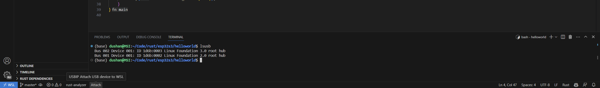
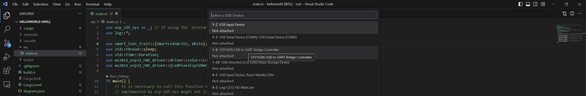
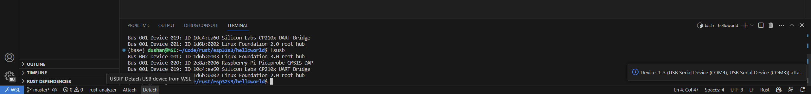
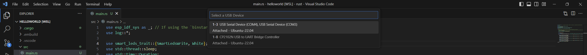

# USBIP Connect README
`USBIP Connect` extenstion allows user to connect to embedded systems developper to easily attached and dettached `USB`, `serial`, `JTAG` devices from Windows to WSL.

## Features
- Allows user to quickly attach and detach USB devices such as the ESP32S3 devkitC via a click of a status bar button 

### Attach

> Click button to show a list of USB devices connected to Windows

> Select desired device from list

### Detach

> The detach button only shows up when devices are attached. When a single device is attached clicking the detach button detaches the device. If multiple devices have been attached, the user can select specific device to detach.

## Required tools
1. WSL Distro On Windows
2. [usbipd-win](https://github.com/dorssel/usbipd-win/releases)

### WSL Distro on Windows
This extension is used within the vscode instance running in WSL. Please do make sure that wsl interop settings are enabled (These are unabled by default)

### usbipd-win
To access the `USB`, `serial`, `JTAG` devices which are from the local windows. Please follow installation process from [usbipd-win](https://github.com/dorssel/usbipd-win) to install usbip on your machine.

## Known Issues
The first time a device is connect, an admin level terminal needs to be used to attach the device. This will be indicated by the notification.

